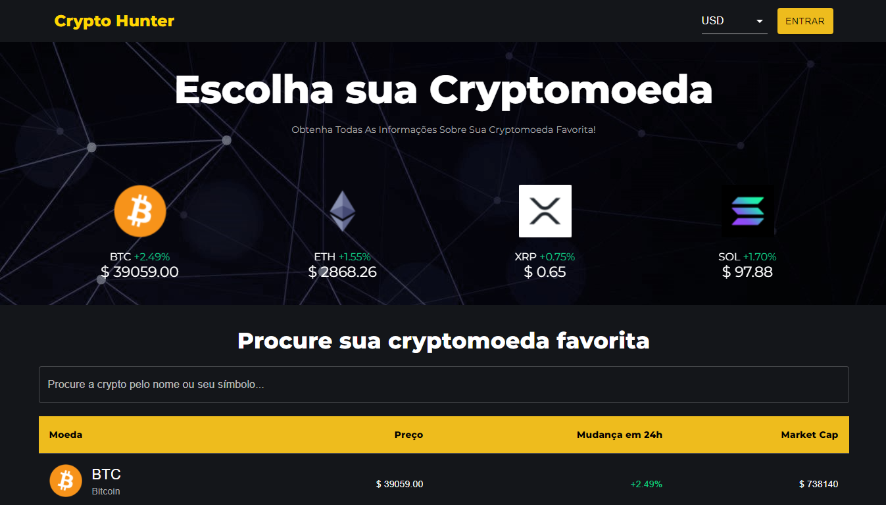
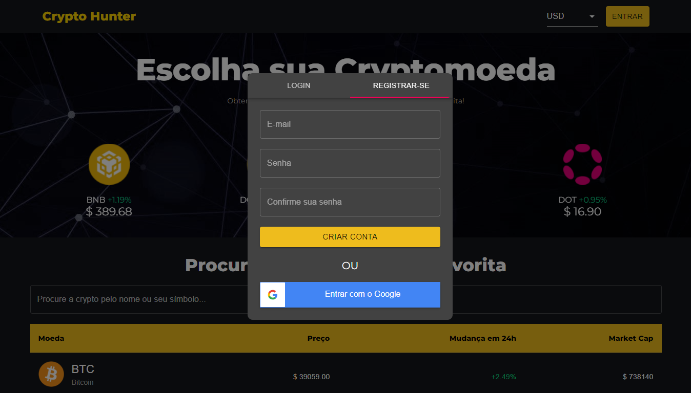
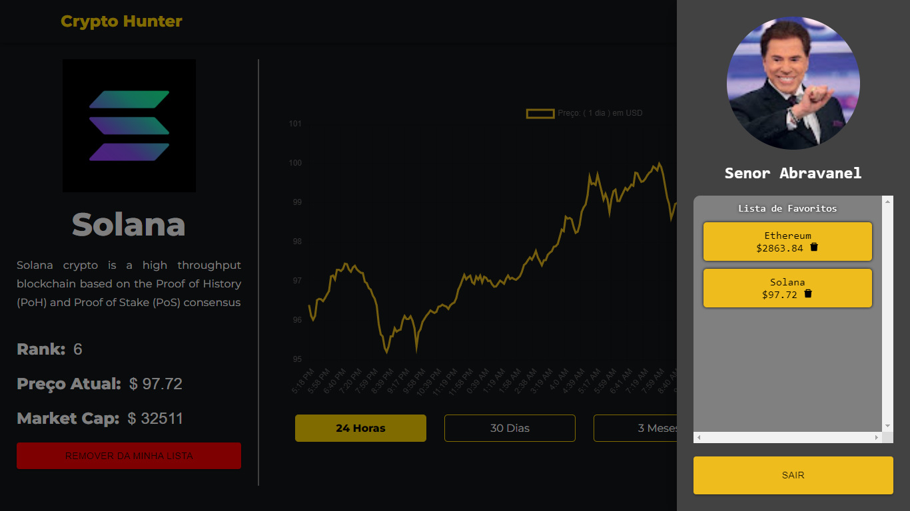
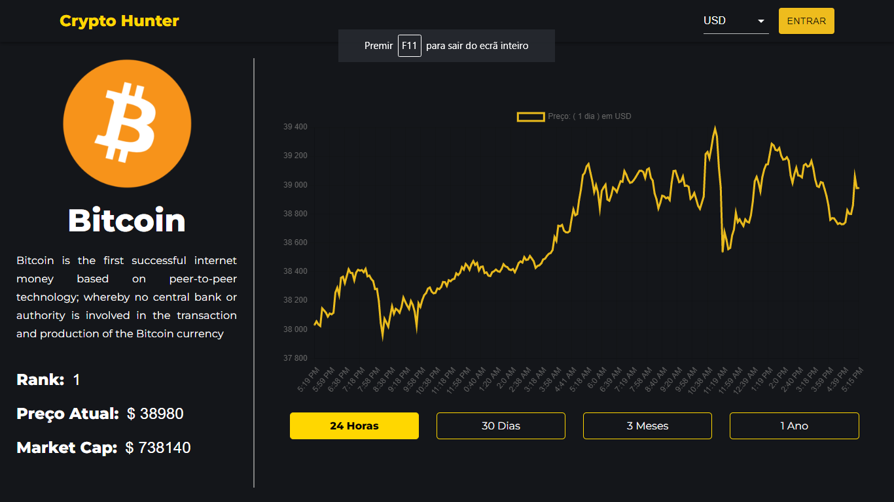

## ⚙️ Project Name <a name = "projectname" ></a>

<p align="left">Cryptocoin Price Tracker (Crypto Hunter)</p>

## ✍️ Project Description

<p align="left">Check the price movement of cryptocurrencies on the market using Mui, ChartJS, Alice Carousel and Firebase.</p>

## 🏁 Table of Contents <a name = "table-of-contents" ></a>

- [About](#projectname)
- [Table of Contents](#table-of-contents)
- [Application View](#application-view)
- [Requirements](#requirements)
- [Technologies](#technologies)
- [Author](#author)

## 🪔 Project Status 

<p align="left"> 
  🚀 Cryptocoin Price Tracker (Crypto Hunter) is finish! 🔥
</p>

## 🖥️ Application View <a name = "application-view" ></a>

<br/>
<h1 align="center">
  
  <p>Search for a cryptocurrency</p>
  
  <p>Sign in or register an account</p>
  
  <p>User panel with favorite coins</p>
  
  <p>My cryptocurrency information</p>
</h1>

## ⛏️ Requirements <a name = "requirements" ></a>

• Before starting, you will need to have the following tools installed on your machine:
[Git](https://git-scm.com), [Node.js](https://nodejs.org/en/). 
Also it's nice to have an editor to work with code like [VSCode](https://code.visualstudio.com/).

## 🎲 Turning the Back End (Server)

```bash
# Clone this repository
$ git clone <https://github.com/diegrp/Crypto-Hunter.git>

# Access the project folder in terminal/cmd
$ cd crypto-hunter

# Install the dependencies
$ yarn

# Run the application in development mode
$ yarn start

# The server will start on port:3333 - access <http://localhost:3333>
```

## 🛠️ Technologies <a name = "technologies" ></a>

• The following tools were used in building the project: 
  
  <b>code install: </b>
  npm i axios react-router-dom react-alice-carousel react-chartjs-2 chart.js@^3.0.0 firebase react-google-button react-icons @material-ui/core @material-ui/lab

- [Node.js](https://nodejs.org/en/)
- [React.js](https://pt-br.reactjs.org/)
- [axios](https://www.npmjs.com/package/axios)
- [react-router-dom](https://www.npmjs.com/package/react-router-dom)
- [Material UI](https://mui.com/pt/)
- [react-alice-carousel](https://www.npmjs.com/package/react-alice-carousel)
- [react-chartjs-2](https://www.npmjs.com/package/react-chartjs-2)
- [firebase](https://www.npmjs.com/package/firebase)
- [react-google-button](https://www.npmjs.com/package/react-google-button)
- [react-icons](https://www.npmjs.com/package/react-icons)

## 👨‍💼 Author <a name = "author" ></a>

- Made with ❤️ by Diego Rocha !